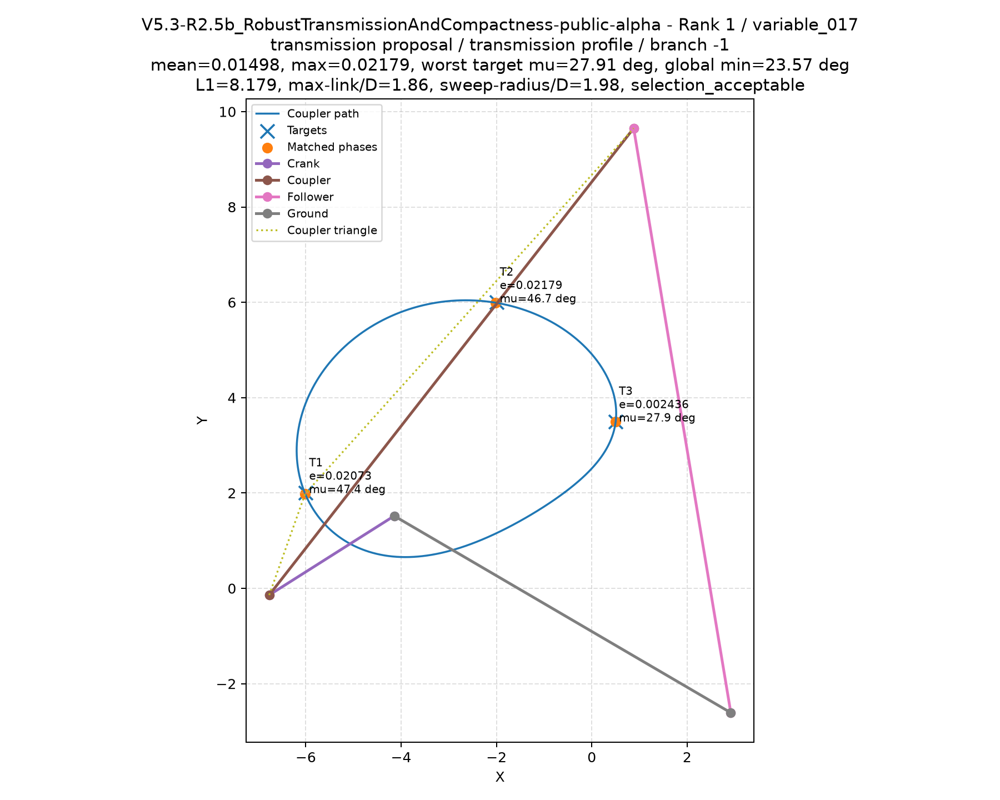

# Mechanism Generator

Open tools for describing motion requirements and developing inspectable mechanism
designs. The long-term aim is to help designers create purpose-built, synchronized
automation using open solvers, training code, and model weights.

**Current status: runnable four-bar research alpha and OMTS v0.1 draft.**
The package includes the R2.5c/R2.5b solver, task validation, and a strict OMTS
adapter. Three Apache-2.0 proposal models are available as verified GitHub release
downloads. This is a planar kinematic research tool; training reproduction,
orientation, timing/dwell, dynamics, collisions, and synchronization remain future work.

## Generate a mechanism

After creating and activating a virtual environment, install from this checkout:

```sh
python -m pip install torch==2.13.0 --index-url https://download.pytorch.org/whl/cpu
python -m pip install ".[engine]"
mechanism-models download --directory models
mechanism-generate --models-directory models --targets -6 2 -2 6 0.5 3.5 --branches both --device cpu --headless --output_root runs/demo
```

Python 3.12 is the tested engine environment. On Windows, choose a short checkout
and output location. Add `--quick` for a smaller search budget. Read the
[engine guide](docs/engine.md) for installation, OMTS execution, and output details,
and the [model card](MODEL_CARD.md) for provenance, licensing, and limitations.



This illustrated candidate passed practical selection criteria, but did not meet
all preferred engineering thresholds. It is not a hardware-validated design.

## Share a run

Runs now prepare a local contribution bundle by default. Open
`contribution/review.html` inside the run directory to choose what to share,
inspect the outgoing data, and download a reviewed file. You can then attach it
to a GitHub submission for possible future solver and training improvements.
Sharing is voluntary, and local preparation sends no data. Read the
[contribution guide](docs/contributing-results.md) for the review and submission
steps, including what becomes public when you attach a file.

## Try the OMTS tools

Requires Python 3.10 or later. From a checkout of this repository, install into a
virtual environment. Activate it using the command for your platform:

```sh
python -m venv .venv
# Linux / macOS:
. .venv/bin/activate
```

```powershell
# Windows PowerShell, after creating .venv:
.\.venv\Scripts\Activate.ps1
```

Then run these commands on either platform:

```sh
python -m pip install -e ".[test]"
omts validate examples/omts/three_point.omts.yaml
omts adapt examples/omts/three_point.omts.yaml --output-dir generated/demo
python -m pytest
```

`python -m mechanism_generator.omts` can replace `omts` in these commands.

Validation checks both the JSON Schema and cross-field semantics. Adaptation
checks the narrower implementation profile and writes a run plan, per-task target
CSVs, and a portable Python runner. It refuses existing output directories.

**A valid document or prepared plan is not a solved mechanism.** No optimizer runs
during either command. The generated runner uses the installed engine and downloaded weights; see the [adapter guide](docs/r25c-adapter.md).

## Two examples, with different purposes

| Example | Document validation | R2.5c adaptation |
|---|---|---|
| [Three-point four-bar](examples/omts/three_point.omts.yaml) | Passes | Prepares an independent cyclic four-bar run |
| [Synchronized line](examples/omts/synchronized_line.omts.yaml) | Passes | Rejected: illustrates future poses, loads, dwell, and synchronization |

The adapter accepts normalized planar coordinates, exactly three target positions,
optional cyclic ordering, hybrid ground-link search, and the requirements listed
in its [profile](docs/r25c-adapter.md). Unsupported operational fields are rejected,
including unsupported soft constraints. They are never silently discarded.

## Project contents

- [OMTS draft specification](specs/omts/0.1/specification.md)
- [Normative schema](src/mechanism_generator/omts/schema.json), bundled with the package
- Shared schema/semantic validation, capability checks, and run preparation
- [Qualification terminology](docs/qualification.md) and [development roadmap](docs/roadmap.md)
- Focused regression tests and continuous integration for Windows and Linux

The public engine runs the research pipeline:
neural proposals → local refinement → physical/kinematic checks → diverse designs.
Orientation synthesis, prescribed timing/dwell, dynamics, collision checks, and
multi-mechanism synchronization are future capabilities.

## Contribute and license

See [CONTRIBUTING.md](CONTRIBUTING.md). Code, specification, schema, examples, and
the three public model-weight exports are licensed under [Apache-2.0](LICENSE),
copyright 2026 Mechanismo-AI contributors. Training datasets are not included.
See [releases](https://github.com/Mechanismo-AI/mechanism-generator/releases) for
versioned model assets and checksums.
