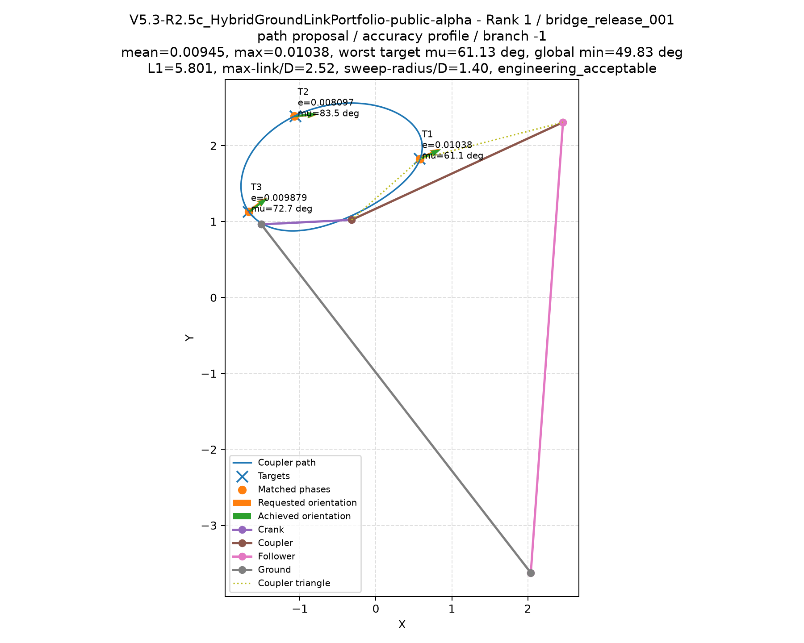

# Design for three positions and orientations

A three-pose task asks the mechanism to place its output point at three locations
with a specified direction at each location. The solver optimizes the position and
orientation at the same three input phases. Those phases remain free; cyclic
ordering can be requested without prescribing speed or timing.

## What the angle means

The tool frame has its origin at output point **P**. Its positive x-axis is
parallel to the directed coupler **A to B**, where A connects to the input crank
and B connects to the output rocker. Angles are measured counterclockwise from
world +x in the right-handed XY plane. The frame has no independently adjustable
mounting angle relative to the coupler.

An orientation of 180 degrees reverses the directed axis. Angular errors wrap
around a full turn, so 179 and -179 degrees differ by 2 degrees. Each target gets
its own tolerance: the default is 5 degrees, and supplied tolerances must be
finite, greater than zero, and less than 180 degrees.

Before numerical refinement, the solver normalizes full turns to an equivalent
angle between -180 and 180 degrees. Saved solver records can therefore show
30 degrees for an OMTS request of 390 degrees; the requested direction is the same.

The three existing neural models still receive only position coordinates. They
propose geometry, and the local solver uses the requested orientations during
phase seeding, refinement, retention of candidate states, and qualification.
This feature uses the published weights without orientation-specific retraining.

## Run the example

Install the engine and download its weights using the [engine guide](engine.md),
then prepare and execute the included OMTS task:

```sh
omts validate examples/omts/three_pose.omts.yaml
omts adapt examples/omts/three_pose.omts.yaml --output-dir runs/three-pose-plan
python runs/three-pose-plan/run_r25c.py --models-directory models --check-only
python runs/three-pose-plan/run_r25c.py --models-directory models
```

Use a new output directory for each plan. Validation and preparation do not run
the optimizer. The runner checks installed engine and model identities before
execution; regenerate plans after upgrading the engine.

The example is the `rotated_return` constructed development case from
[the benchmark script](../tools/benchmark_pose.py). It requests T1, T2, T3 in
increasing cyclic order, with these world-frame targets:

| Target | x | y | Orientation | Angular tolerance |
|---|---:|---:|---:|---:|
| T1 | 0.5723634740305128 | 1.8285046113880585 | 25.23301030623304° | 2° |
| T2 | -1.0631683341627678 | 2.3861503196170397 | 4.9416126370162505° | 2° |
| T3 | -1.6790799018605853 | 1.1314730782724207 | 37.27670309902946° | 2° |

A known four-bar geometry generates these targets analytically. Its parameters
establish feasibility and are retained in the benchmark source for inspection;
the search receives the targets and requirements. Finding an eligible design
still depends on the search, so fewer than the requested results, including zero,
is possible. The example is a development probe rather than a general performance
claim or a hardware-validated design.

The [recorded OMTS execution](pose-example.json) produced 17 candidates and selected
4; all four also met the engine's preferred kinematic thresholds. Independent
geometry checks confirmed that every selected design meets the position and
2-degree orientation tolerances and assembles through a full input revolution.



The illustrated design has mean position error 0.00945, maximum position error
0.01038, and maximum orientation error 0.6374 degrees. Its independent minimum
transmission angles are 61.13 degrees at the targets and 49.83 degrees over the
full cycle. Inspect its [candidate data](../examples/results/three_pose_candidate.json)
or the report's exact settings, hashes, and metrics for all four selections.
These are kinematic results; physical validation remains outstanding.

For direct command-line use, provide all three orientations and tolerances:

```sh
mechanism-generate --models-directory models --targets 0.5723634740305128 1.8285046113880585 -1.0631683341627678 2.3861503196170397 -1.6790799018605853 1.1314730782724207 --target_orientations_deg 25.23301030623304 4.9416126370162505 37.27670309902946 --orientation_tolerances_deg 2 2 2 --phase_mode ordered --profile_matrix paired --branches both --device cpu --headless --output_root runs/three-pose
```

OMTS requires orientations on all three targets or none. It keeps each target's
position, orientation, and tolerance together when applying `order_index`.
The direct orientation arguments apply to one target triple per run; use separate
OMTS tasks to prepare different requests. See the [adapter guide](r25c-adapter.md)
for the supported fields.

## Read the result

Inspect `all_candidates.csv` for every attempted design, including failures.
Pose candidates report each requested angle, achieved angle, and angular error,
plus `orientation_acceptable` and `pose_acceptable`. The latter requires both
position and orientation acceptance. A candidate can still fail the additional
selection criteria for transmission, robustness, or compactness.

Selected results always require `selection_eligible`. A good position fit with a
failed angle is labeled `path_acceptable_but_orientation_failed` and cannot be
selected. Optional selected-design plots show requested and achieved orientation
arrows at the target points. Read the [qualification guide](qualification.md)
before interpreting the engine's engineering labels.

## Reproduce the controlled comparison

The benchmark runs position-only and pose-aware searches with the same configured
budgets and seed, then independently recomputes both position and orientation
errors from each candidate's geometry. The reference parameters are not used to
initialize either search.

```sh
python tools/benchmark_pose.py --models-directory models --budget standard --output runs/pose-benchmark
```

Use `--cases rotated_return` for one case or `--generate-only` to write the
reference tasks without running a search. A fresh output directory is required.
The report records completion status, model/engine identities, runtime, selected
candidates meeting both tolerances, and failures.

The [recorded standard comparison](pose-benchmark.json), using seed 101, completed
all eight runs. Pose-aware search returned selected designs satisfying both the
position and 2-degree angular tolerances in **2 of 4 cases**. Position-only search
returned none satisfying those same combined requirements. The counts below are
selected designs that independently passed both sets of tolerances:

| Constructed case | Position-only search | Pose-aware search |
|---|---:|---:|
| `wide_sweep` | 0 | 0 |
| `rotated_return` | 0 | 3 |
| `offset_tool` | 0 | 5 |
| `angle_wrap` | 0 | 0 |

The separately recorded OMTS example above selected four designs; the benchmark's
`rotated_return` run selected three. Each report preserves its execution settings
and artifact identities. These are individual executions, not a promise of a
fixed candidate count.

`wide_sweep` and `angle_wrap` remain search failures at these budgets despite
having known feasible reference geometries. The four constructed development
cases and one seed do not estimate general design success. Equal configured
budgets need not mean equal runtime; the recorded timings are descriptive.

A separate [point-only parity check](pose-point-parity.json) compared the released
v0.1.0a3 wheel with this implementation on one fixed-seed case at quick budgets.
All 2,232 compared common fields matched exactly, including 1,660 numeric fields;
candidate identities and ordering matched for 16 candidates and 2 selections.
Runtime and history locations were excluded. This checks that specific regression
case, rather than proving equivalence for every position-only task.

Continuous orientation paths, a free tool mounting angle, prescribed phases,
timing/dwell, loads, collisions, and physical validation remain outside this first
pose capability.
