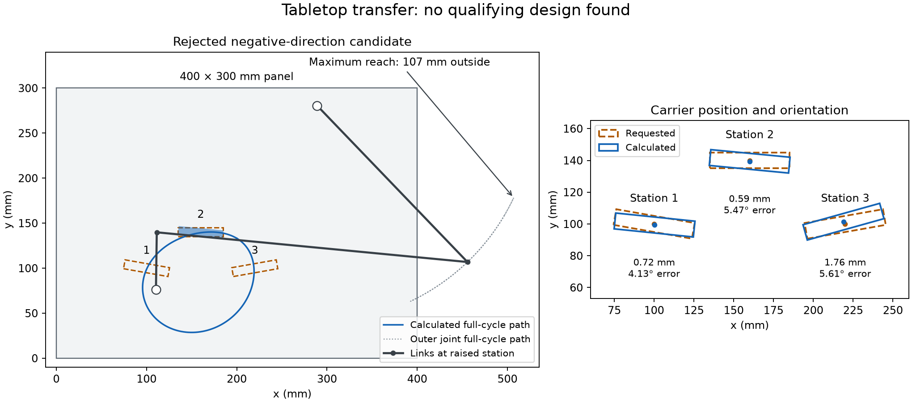

# Tabletop transfer platform: baseline failure and diagnosis

**The released baseline found no qualifying design.** This dimensioned case study evaluates the
released v0.1.0a6 solver against a brief specified before the search. It is an
example of recording and diagnosing a failed design search, not a construction
plan or a proof that the requested motion is impossible.

A subsequent [controlled diagnosis](Diagnosis.md) found one candidate within the
original hard limits by sampling inside the existing angle tolerances. That
private research result has tight margins and has not been integrated into the
released solver. The original measurements below remain the baseline record.



## Fixed brief

A 50 × 10 mm carrier moves between three poses on a tabletop demonstrator with
a vertical mounting panel. The carrier centre is output point P; its directed
long axis is parallel to coupler A→B. Coordinates are in millimetres, x right,
y up. Angles are counterclockwise from +x.

| Station | Centre (mm) | Carrier angle |
|---|---|---|
| 1. Pickup | (100, 100) | −10° |
| 2. Raised midpoint | (160, 140) | 0° |
| 3. Placement | (220, 100) | +10° |

The target order is 1→2→3; either crank direction is allowed. Limits are 1 mm
mean position error, 1.5 mm at every individual station, and 3° angle error at
every station. The panel spans x=0…400 and y=0…300 mm. Both fixed pivots require
10 mm clearance from the panel edges. Full-cycle assembly, a shortest input
crank, Grashof classification, and minimum transmission angles of 15° at the
targets and 10° over the cycle are retained from the supported solver profile.

Panel fit is a separate **post-search screen**, not a solver-enforced constraint.
The screen includes moving joint centres, fixed pivots, and all four carrier
corners at 7,201 equally spaced input phases. Link centrelines between these
endpoints are inside the rectangular panel when their endpoints are inside it.
This does not check link thickness, bearings, collisions, forces, payload,
manufacturing tolerances, timing, dwell, or continuous containment between samples.
Carrier orientation is required only at the three specified phases.

The [physical brief](design-brief.json) was frozen before execution. The
[OMTS input](../omts/tabletop_transfer.omts.yaml) uses an explicit conversion
because the released adapter accepts normalized lengths:

```
physical_xy_mm = 30 * normalized_xy + [250, 40]
physical_length_mm = 30 * normalized_length
```

Angles and the dimensionless coupler attachment ratio are unchanged. This maps
the targets to (−5,2), (−3,10/3), and (−1,2); tolerances are divided by 30.
It does not add native millimetre support to OMTS execution.

## Measured outcome

Run date: 2026-09-16. Baseline source:
`4874fca1f26628e983a8403ce74cb8cb9b095e8a` (v0.1.0a6).
The released balanced, path, and transmission weights were unchanged. CPU,
float64, seed 101, paired profiles, both assembly branches, standard search
budgets, and 4,096 geometric pose samples were used. Either direction gives
each search its complete budget. There were 18 final portfolio candidates per
direction, **36 total, zero engine-eligible and zero passing the physical brief**.

The table describes one rejected diagnostic candidate per direction, chosen by
the smallest worst ratio to the three pose tolerances. Panel fit is excluded
from that ranking. These are not selected or recommended mechanisms.

| Measurement | Allowed | Negative `variable_006` | Positive `bridge_release_001` |
|---|---:|---:|---:|
| Mean position error | ≤1 mm | 1.025 mm | 24.447 mm |
| Largest position error | ≤1.5 mm | 1.762 mm | 36.545 mm |
| Largest carrier-angle error | ≤3° | 5.608° | 10.422° |
| Rightmost sampled extent | ≤400 mm | 506.957 mm | 503.995 mm |
| Full-cycle assembly | Required | Pass | Pass |
| Minimum full-cycle transmission angle | ≥10° | 36.188° | 26.356° |

The [assessment](assessment.json) contains all 36 independent physical checks,
exact candidate parameters and phases, individual failure reasons, and the
engine/model hashes. Its link lengths, output offset and base coordinates are
in millimetres; `S_ratio` remains dimensionless and `base_angle` and input phases
remain radians. Parameter order is the order in `tools/benchmark_pose.py`.
Independent position and angle calculations agree with the saved engine metrics
to within 10⁻⁶ mm/degrees after conversion.

For each direction, the original exact-pose initializer found 2,397 in-bounds
geometries from 4,096 samples, but none passed the combined full-cycle,
robustness and crank-shortest filters. A separately recorded diagnostic with
65,536 samples found 38,453 in-bounds geometries and again none passed that
combined filter. It did not rerun the optimizer or change the brief. The same
geometry samples are reused across directions; these are not independent
statistical trials. See [diagnostic counters](seed-diagnostic.json).

These bounded searches do not establish infeasibility. In particular, the
screening counter combines several conditions; it does not isolate one as the
cause. Increasing the sample count alone did not resolve this case.

## Reproduce and inspect

Use a source checkout with the engine dependencies installed and the released
models downloaded, following the repository installation guide. Use a short
output path on Windows. From the repository root:

The commands below reproduce the baseline with the **v0.1.0a6 engine**. For the
current checkout, use the separate
[integrated panel example](../../docs/tolerance-and-panel.md#tabletop-regression).
The baseline task file deliberately remains readable by the released adapter.

```sh
omts validate examples/omts/tabletop_transfer.omts.yaml
omts adapt examples/omts/tabletop_transfer.omts.yaml --output-dir runs/tabletop
python runs/tabletop/run_r25c.py --models-directory models
python tools/assess_tabletop_transfer.py --results runs/tabletop/results --output runs/tabletop-assessment.json
```

The assessment reads saved artifacts and uses NumPy geometry independent of the
optimizer. It verifies the task positions and angles, checks all candidate rows
against saved metrics, evaluates physical limits, and refuses an existing output
file. It expects exactly one positive and one negative completed run. For a
historical comparison, retain the specified engine version and model hashes;
later solver changes can change the result. No upload is performed.

## What this changes in the roadmap

This is now a **development case**, not an untouched evaluation holdout. Keep the
brief and baseline result fixed while investigating which exact-pose constraint
excludes candidates. Next, compare bounded search improvements and supported
tool-frame/attachment representations, with the panel envelope included during
search. Any relaxed requirement or different mechanism topology needs a separately
named experiment. Evaluate improvements on additional frozen practical tasks
before claiming broader gains or considering another model-weight release.

The next implementation step is now released in v0.1.0a7: [tolerance-aware initialization and sampled panel screening](../../docs/tolerance-and-panel.md)
recover one selected design within this original brief. Both baseline evidence
and the subsequent [integrated assessment](integration/assessment.json) are retained.
